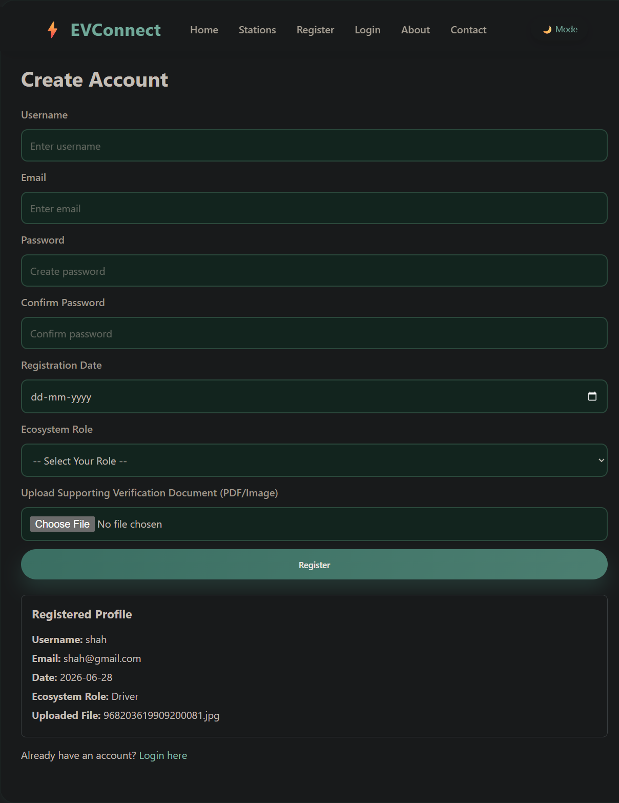

# Lab 3: Responsive Registration Form

## 📌 Project Overview
A web page built to handle user registration with client-side validation, dynamic data rendering, and data persistence.

## 🛠️ Requirements Implemented
* **Form Controls:** Textbox (Full Name), Password, Email, Calendar (DOB), File Upload (Profile Picture), and Dropdown menu (Course Selection).
* **Validation:** Enforced input constraints (`required`, `minlength`, correct semantic types).
* **Arrow Function:** Implemented a JavaScript arrow function `(event) => { ... }` to handle the button click event and prevent page reload.
* **Dynamic Card Output:** Submitting the form immediately displays a formatted data card right below the form.

## 💡 Self-Learning Objectives
* **Responsiveness:** Built using fluid CSS layouts to ensure the form and card scale gracefully across mobile, tablet, and desktop viewports.
* **Local Storage:** Integrates `localStorage` to save the registered user data, ensuring it automatically reloads and persists even if the browser is refreshed.

## 📸 Output Preview
